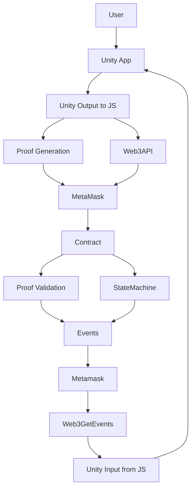

```mermaid
graph 
    U[User] --> D[Unity App]
    D --> UO[Unity Output to JS];
    UO --> P[Proof Generation] & W3[Web3API] --> MetaMask
    MetaMask --> Contract
    Contract --> PV[Proof Validation] & StateMachine --> Events
    Events --> Metamask
    Metamask --> Web3GetEvents
    Web3GetEvents --> UI[Unity Input from JS]
    UI --> D
```