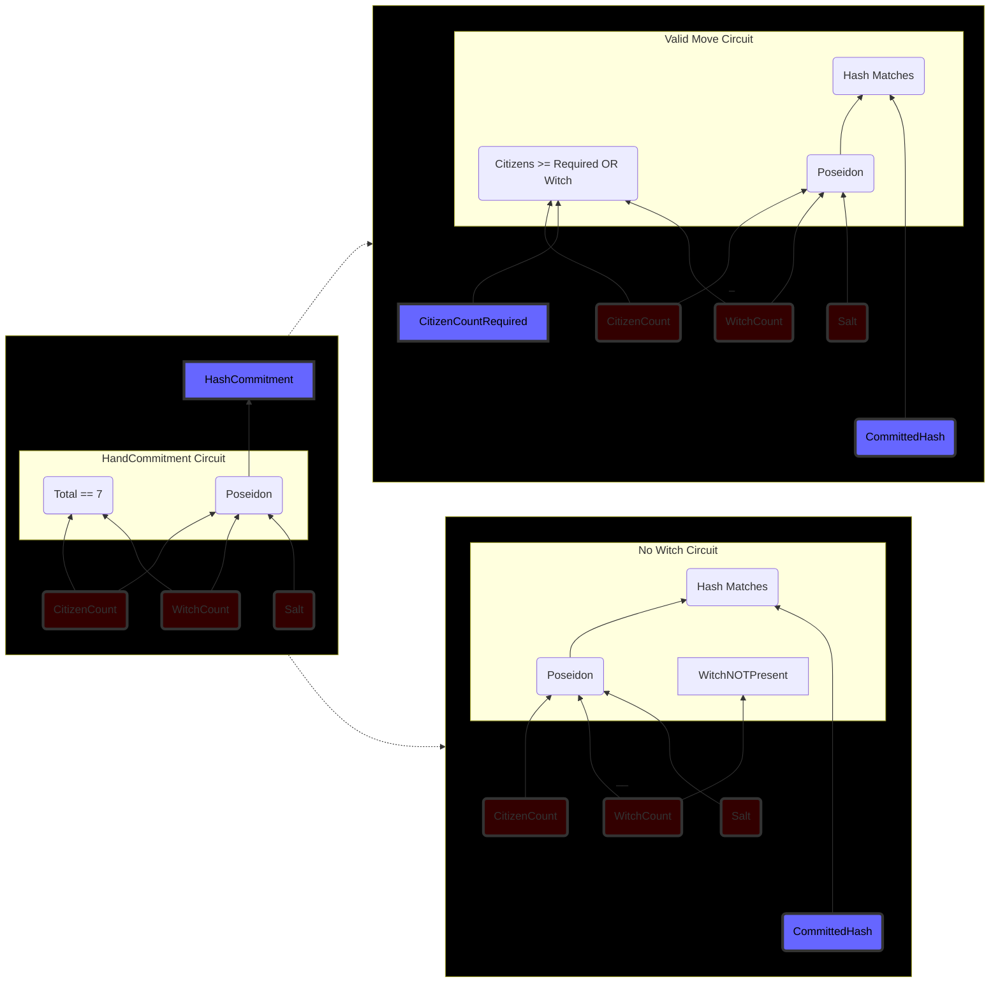

```mermaid
flowchart LR
    subgraph HandCommitmentGraph
        direction BT
        CC1(CitizenCount) --> VA(Total == 7)    
        CC1 --> P1(Poseidon)
        WC1(WitchCount) --> VA    
        WC1 --> P1
        S1(Salt) --> P1
        P1 --> HashCommitment 
        subgraph HandCommitment Circuit
        P1
        VA
        end
    end

    subgraph ValidMoveGraph
        direction BT
        CC2(CitizenCount) --> VM(Citizens >= Required OR Witch)
        CitizenCountRequired -->VM    
        CC2 --> P2(Poseidon)
        WC2(WitchCount) --> VM    
        WC2 --> P2
        S2(Salt) --> P2
        P2 --> M2(Hash Matches)
        PH2(CommittedHash) ----> M2 

        subgraph Valid Move Circuit
            P2
            M2
            VM
        end

        subgraph _
            CC2
            WC2
            S2
        end
    end

    subgraph NoWitchGraph
        direction BT
        CC3(CitizenCount) --> P3(Poseidon)
        WC3(WitchCount) --> WitchNOTPresent
        WC3 --> P3
        S3(Salt) --> P3
        P3 --> M3(Hash Matches)
        PH3(CommittedHash) ----> M3 

        subgraph No Witch Circuit
            P3
            M3
            WitchNOTPresent
        end
        
        subgraph __
            CC3
            WC3
            S3
        end
    end
    HandCommitmentGraph -.-> ValidMoveGraph
    HandCommitmentGraph -.-> NoWitchGraph


    style HandCommitmentGraph fill:#000000,color:#000000
    style NoWitchGraph fill:#000000,color:#000000
    style ValidMoveGraph fill:#000000,color:#000000

    style _ fill:#000000,stroke-width:0px
    style __ fill:#000000,stroke-width:0px

    style CC1 fill:#330000,stroke:#333,stroke-width:4px
    style CC2 fill:#330000,stroke:#333,stroke-width:4px
    style CC3 fill:#330000,stroke:#333,stroke-width:4px

    style WC1 fill:#330000,stroke:#333,stroke-width:4px
    style WC2 fill:#330000,stroke:#333,stroke-width:4px
    style WC3 fill:#330000,stroke:#333,stroke-width:4px

    style S1 fill:#330000,stroke:#333,stroke-width:4px
    style S2 fill:#330000,stroke:#333,stroke-width:4px
    style S3 fill:#330000,stroke:#333,stroke-width:4px

    style PH2 fill:#6666FF,stroke:#333,stroke-width:4px,color:#000
    style PH3 fill:#6666FF,stroke:#333,stroke-width:4px,color:#000
    style CitizenCountRequired fill:#6666FF,stroke:#333,stroke-width:4px,color:#000
    style HashCommitment fill:#6666FF,stroke:#333,stroke-width:4px,color:#000
```