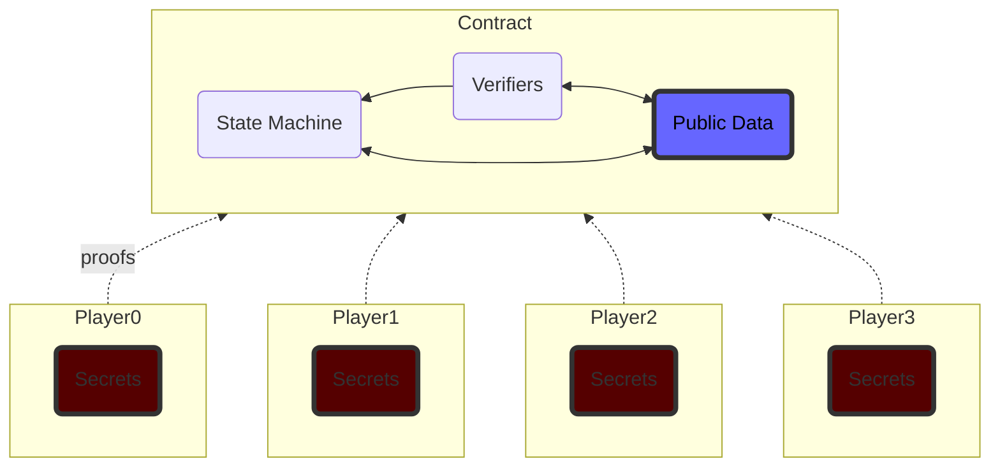

```mermaid
flowchart BT
    subgraph Player0
        direction LR
        P1S(Secrets)
    end
    
    subgraph Player1
        direction LR
        P2S(Secrets)
    end

    subgraph Player2
        direction LR
        P3S(Secrets)
    end

    subgraph Player3
        direction LR
        P4S(Secrets)
    end


    subgraph Contract
        direction RL

        V(Verifiers) --> S(State Machine)
        P(Public Data) <--> S(State Machine)
        P(Public Data) <--> V
    end

    Player0 -.->|proofs|Contract
    Player1 -.-> Contract
    Player2 -.-> Contract
    Player3 -.-> Contract

    style P1S fill:#550000,stroke:#333,stroke-width:4px
    style P2S fill:#550000,stroke:#333,stroke-width:4px
    style P3S fill:#550000,stroke:#333,stroke-width:4px
    style P4S fill:#550000,stroke:#333,stroke-width:4px

    style P fill:#6666FF,stroke:#333,stroke-width:4px,color:#000

```